# IBM Talk'n' Labs | DEVOPS

- [IBM Talk'n' Labs | DEVOPS](#ibm-talkn-labs--devops)
  - [Introdução](#introdu%c3%a7%c3%a3o)
  - [Pré-requisitos](#pr%c3%a9-requisitos)
  - [1 - Criando uma toolchain](#1---criando-uma-toolchain)
  - [2 - Alterando sua aplicação](#2---alterando-sua-aplica%c3%a7%c3%a3o)
  - [4 - Integrando com o GitHub](#4---integrando-com-o-github)

## Introdução
Uma toolchain é uma coleção de ferramentas que ajudam no desenvolvimento, deploy e tarefas operacionais. Neste Lab, vamos criar uma toolchain a partir de um template para subir uma aplicação em Cloud Foundry. Este template possui um conjunto de ferramentas integradas e um codigo simples de um 'Hello World' em NodeJS. Esta toolchain é pre configurada para continuous delivery, source control, issue tracking e edição de codigo online. 

<!-- O Banco do Brasil, maior banco da América Latina, com destaque em segmentos como agronegócio, infraestrutura, micro e pequenas empresas.
O seu maior propósito é estar próximo das pessoas e ajudar a preservar o que é importante para seus clientes, acionistas, funcionários e toda a sociedade.
Por esta razão, pensando no pequeno e médio agricultor, que muitas vezes não tem acesso, desconhece ou não tem capacidade financeira para contratar soluções robustas que os auxiliem na gestão e monitoramento de seus processos produtivos, o Banco do Brasil quer desenvolver solução de baixo custo, para que estes proprietários através do controle de temperatura e umidade do solo, possam planejar melhor sistemas de irrigação baseado no tipo do produto, além de sistema de reconhecimento de pragas e qualidade do plantio através de processamento de imagens capturadas com drones. -->
## Pré-requisitos

Você deverá cumprir os seguintes itens:

- Ter uma conta na IBM Cloud
- Ter uma conta no [GitHub](https://github.com/) ou criar uma nova;

## 1 - Criando uma toolchain
1 - Abra o portal da [IBM Cloud](https://cloud.ibm.com) 

2 - Faça o login em sua conta 
3 - No canto superior esquerdo, clique no menu de navegação e clique em `devops`. 
 

    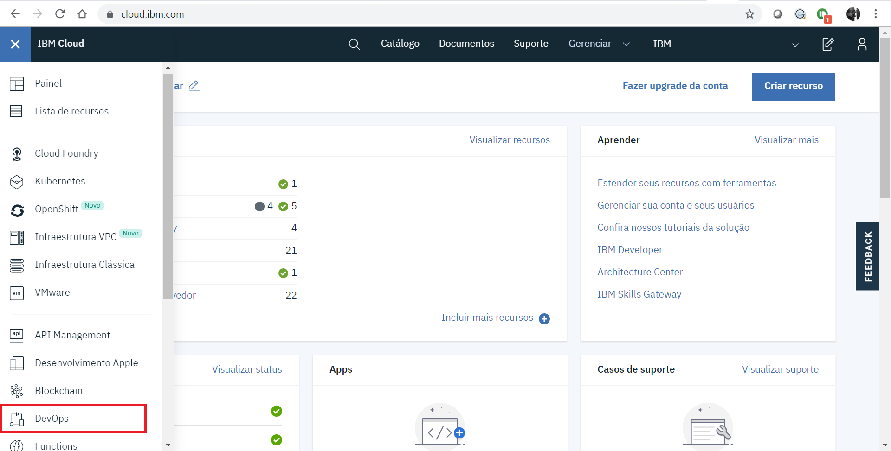
    
Imagem 1: IBM Cloud Home

4 - Na tela de criação de toolchain, clique em `Create a Toolchain`.  
 

    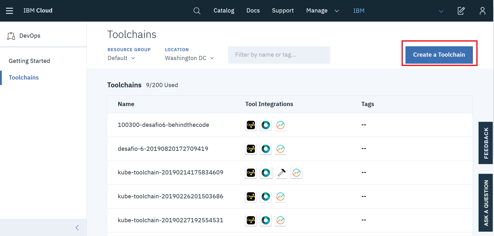
    
Imagem 2: Toolchains

5 - Como podemos ver, podemos criar a nossa toolchain do zero, ou utilizar algum dos templates, como kubernetes e Cloud Foundry. Selecione Develop Cloud Foundry APP.

    
    
Imagem 3: Creating a Toolchain

6 - Dê um nome a sua toolchain, selecione uma região e um resource group.
 

    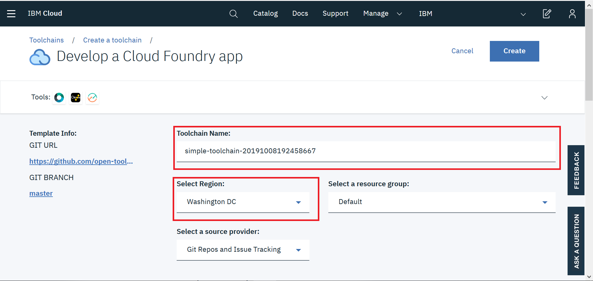
    
Imagem 4: Toolchain Configs

7 - Em Git Repos and Issue Tracking, dê um nome ao seu repositorio.
 

    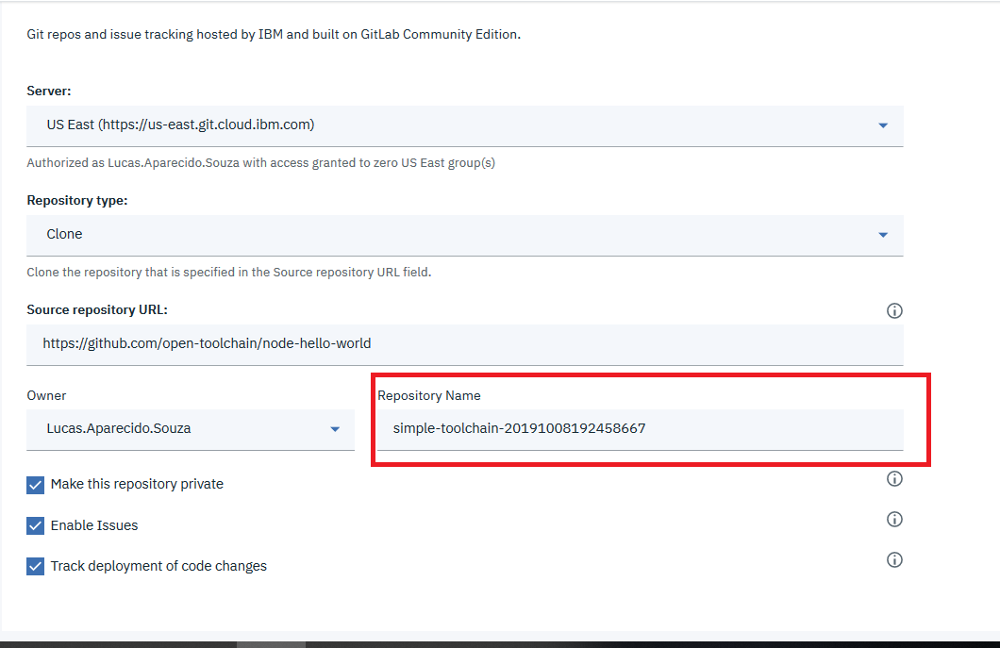
    
Imagem 5: Git Repos and Issue Tracking

8 - Clique em  `Delivery Pipeline`, entao dê um nome para seu aplicativo.

9 - Em API Key, clique em `Create`, para gerar uma nova API, e espere os campos seguintes carregarem.
**OBS Caso não apareça automaticamente sua org e space, troque a region para Dallas**
 

    
    
Imagem 6: Delivery Pipeline Config

10 - Feito isso, no canto superior direito da tela, clique em Create.   Você será redirecionado para o Dashboard da sua Toolchain. Nesta página, temos 4 ferramentas: Issues, Git, Delivery Pipeline e Eclipse.
O processo de deploy da sua aplicação já está sendo executado. Podemos visualiza - lo clicando na ferramenta Delivery Pipeline. 

O Delivery Pipeline automatiza o Continuous Deployment de um projeto. Nele, podemos criar nossa esteira com uma sequencia de estágios e rodar tarefas como builds, testes e deployments. Neste exemplo, nosso pipeline possui apenas 2 tarefas: Build e Deploy.
10 - Para visualizar a aplicação que acabamos de criar, aguarde até que apareça `Stage Passed` em Deply, então, clique em View Console, onde irá te redirecionar para o dashboard da aplicação no Cloud Foundry. 
11 - Clique em Visit App URL.
 
 
 

## 2 - Alterando sua aplicação
A toochain que criamos está integrada com o git, ou seja, quando uma alteração for realizada no repositório, o processo de deploy será executado automáticamente e a sua aplicação será atualizada.
Para testar este processo, volte para o dashboard da toolchain.    
1 - primeiramente, vamos visualizar o Git que foi criado. Em code, clique em Git. Este é um Git próprio da IBM Cloud que é criado automáticamente com a nossa toolchain. Abrindo o arquivo manifest.yml, podemos ver as configurações necessárias para a nossa aplicação no Cloud Foundry. 

    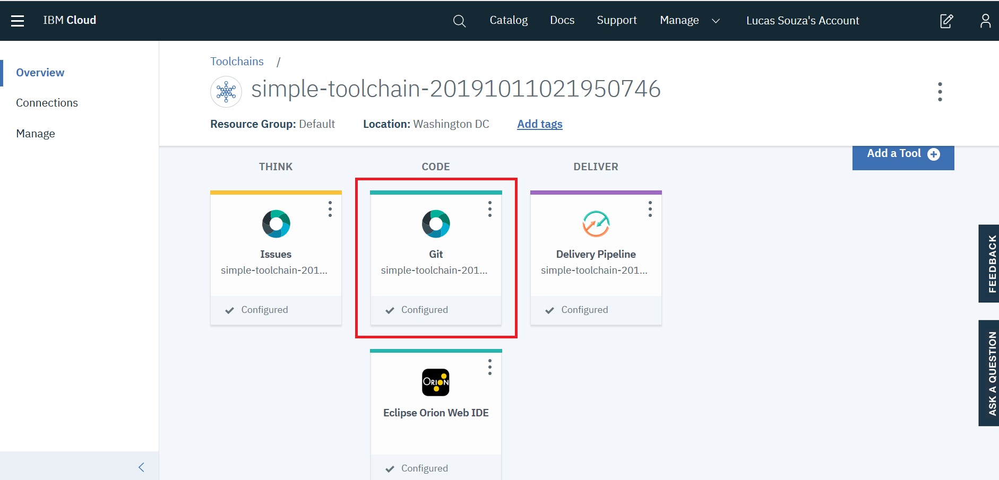
    
Imagem 7: Toolchain

    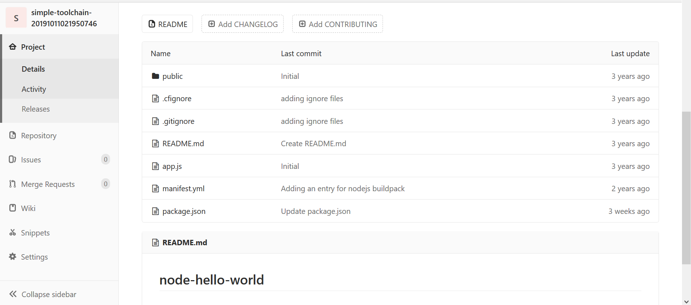
    
Imagem 8: Git IBM Cloud

  
2 - Agora, vamos editar nosso codigo. Para isso, nossa toolchain conta com o Eclipse orion Web IDE, que permite alterar os códigos sem precisar de uma IDE Local. Abra esta ferramenta.  

3 - Abra a pasta public, depois, abra o arquivo index.html. Altere onde está escrito Hello World para uma frase de sua preferência.  

    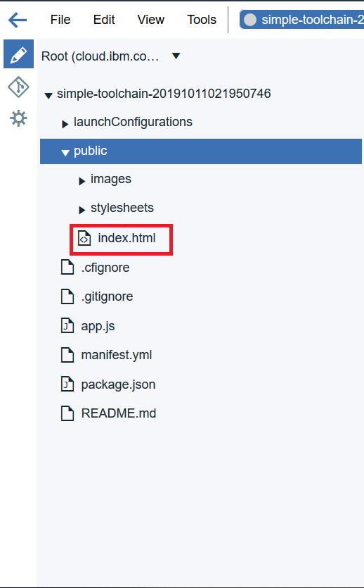
    
Imagem 9: Public dir

    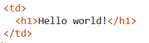
    
Imagem 11: Edit

4 - No canto superior esquerdo, clique em File > Save. 
5 - Agora, precisamos validar nossa alteração no repositório para que a aplicação seja atualizada. Na aba a esquerda, clique no segundo icone. Ao carregar, podemos ver que a alteração já foi reconhecida, então, basta digitarmos uma mensagem e clicarmos em commit. 

    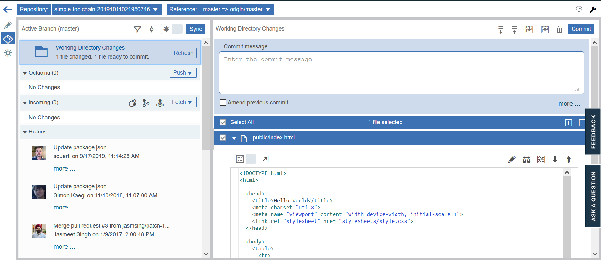
    
Imagem 12: Commit

6 - Em outgoing, poderemos ver a alteração realizada. Clique em push e aguarde o processo ser sucedido. 
7 - Feito isso, podemos fechar o editor e voltar para nossa toolchain. Clicando novmaente no Delivery Pipeline, podemos ver os processos em execução novamente. Ao fim das tarefas, abra novamente a aplicação e veja o resultado da alteração.

## 4 - Integrando com o GitHub
Até agora, criamos e alteramos uma aplicação com o código armazenado no Git padrão da toolchain, mas e se o nosso código estivesse no github? 
Para isso, basta adicionarmos uma integração com o GitHub na nossa toolchain. 
1 - Novamente no Dashboard, clique em `ADD A TOOL` 
2 - Adicione a ferramenta do GitHub. 

    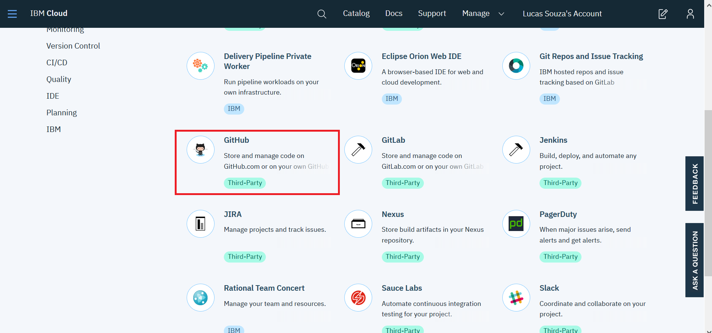
    
Imagem 13: Ferramentas

3 - Clique em Authorize e faça login em sua conta do github para autorizar a integração 

    
    
Imagem 14: Authorize

4 - Dê um nome para o repositório e crie a integração. 
5 - Sua ferramenta já foi configurada, agora, precisamos configurar o nosso pipeline. Abra o Delivery Pipeline. 
6 - Em Build, clique na engrenagem e selecione a opção Configure Stage  

    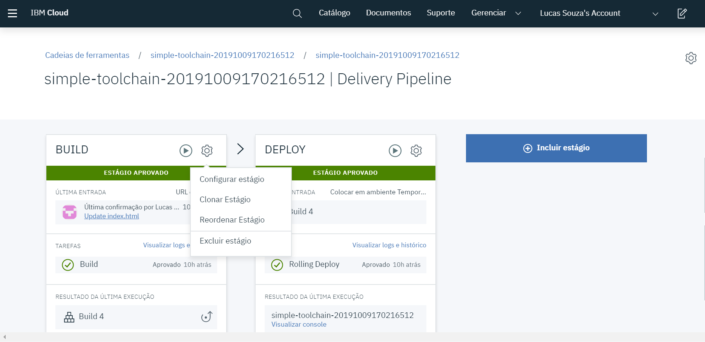
    
Imagem 15: Configuring Buid

7 - Vá para a aba Input.  
8 - Em Repositorio git, selecione o novo repositório criado.  
9 - Clique em Salvar  

    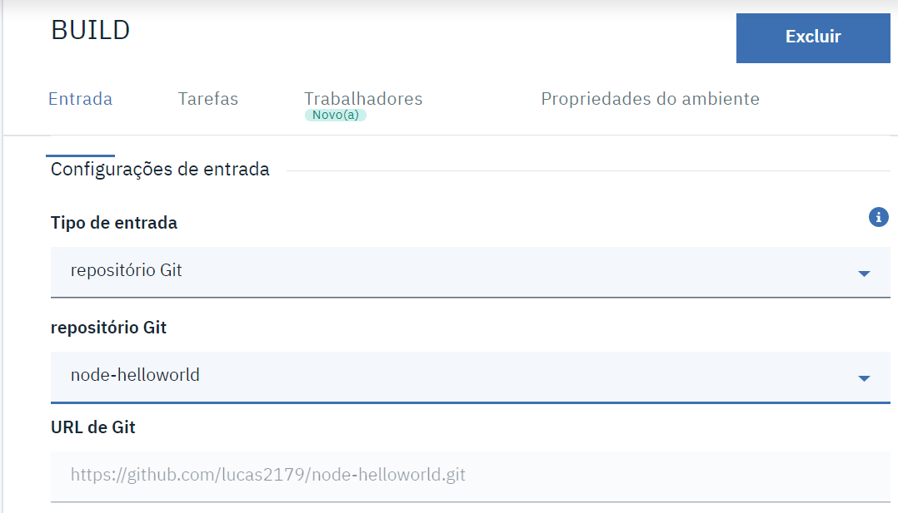
       
Imagem 16

10  - Exclua os antigos Gits  
div align="center">
    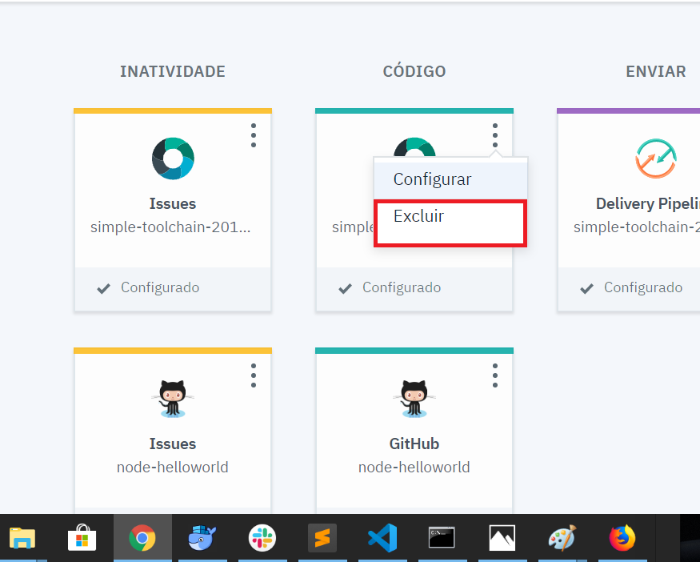
       
Imagem 17: Excluindo o Git Antigo

11 - Faça uma alteração no codigo do novo repositorio.  
12 - Dê um commit na nova alteração.  
13 - Abra novamente o Delivery pipeline e veja o processo de deploy ser realizado novamente. Ao termino, abra a aplicação novamente para visualizar a alteração.

